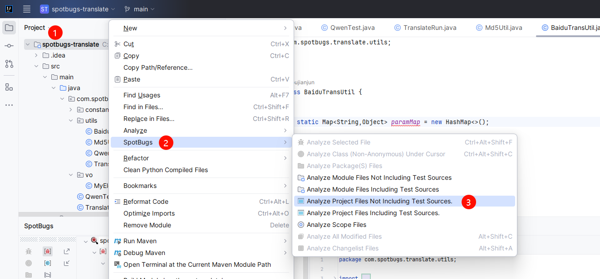
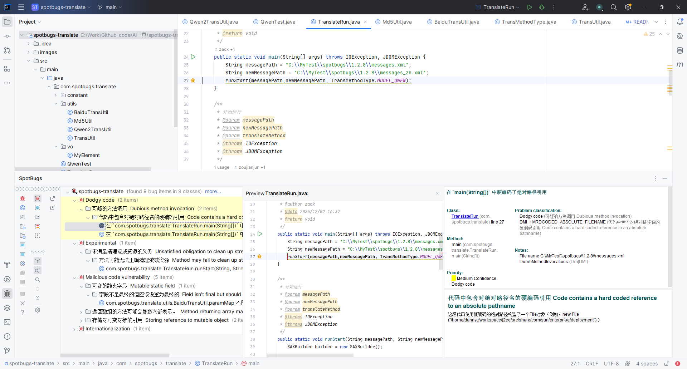

### 一、下载插件

**在idea官网下载idea对应版本的插件**

官网地址：https://plugins.jetbrains.com/plugin/14014-spotbugs/versions/stable


**版本对应：**

| idea版本          | spotbugs版本            |
| ----------------- | ----------------------- |
| 2022.2+           | spotbugs-idea-1.2.8.zip |
| 2022.2+           | spotbugs-idea-1.2.7.zip |
| 2019.3 - 2023.2.8 | spotbugs-idea-1.2.5.zip |
| 2019.3 - 2023.2.8 | spotbugs-idea-1.2.4.zip |


### 二、翻译配置

把message.xml从 `spotbugs-idea-1.2.8.zip` > `lib` > `spotbugs-4.8.6.jar` > `message.xml` 复制出来


> 有两种方式可以自由选择

#### 2.1、Ai翻译

通过调用本地安装的ollama部署的qwen2.5大模型，进行Ai智能翻译


#### 2.2、百度翻译

使用百度翻译进行机翻

##### 需要去配置百度翻译的应用ID

```java
public class BaiduConstant {
    /**
     * 应用ID
     */
    public static final String TRANS_APPID = "xxxx";
    /**
     * 秘钥
     */
    public static final String TRANS_PASS = "xxxx";
   
}
```

### 三、执行翻译

> 修改TranslateRun的main方法的message.xml的路径，并运行main方法

```java
public static void main(String[] args) throws IOException, JDOMException {
        String messagePath = "C:\\MyTest\\spotbugs\\1.2.8\\messages.xml";
        String newMessagePath = "C:\\MyTest\\spotbugs\\1.2.8\\messages_zh.xml";
        runStart(messagePath,newMessagePath,TransMethodType.MODEL_QWEN);
}
```


将messages_zh.xml放到`spotbugs-idea-1.2.8.zip` > `lib` > `spotbugs-4.8.6.jar`中去。


### 四、安装插件

使用IDEA的Install Plugin from Disk选择zip文件再重新安装，并重启idea

已经翻译好的插件压缩包：https://github.com/tyzou/spotbugs-translate/releases






